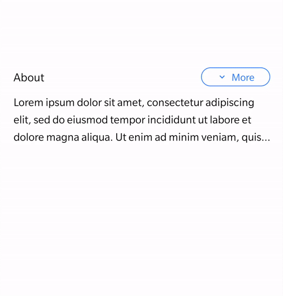

# React Native Collapsible Button

<p align="center">
    
</p>

## Installation

```js
npm install react-native-collapsible-button
```

## Usage

<details>
    <summary>Example</summary>
    
 ```js
import { StatusBar } from "expo-status-bar";
import React, { useState } from "react";
import { StyleSheet, Text, View } from "react-native";

import { CollapsibleButton } from "react-native-collapsible-button";

const App = () => {
    const [value, setValue] = useState(true);

    const handleValue = () => setValue(!value);

    return (
        <View style={styles.mainContainer}>
            <StatusBar style="auto" />
            <View style={styles.container}>
                <Text style={styles.text}>About</Text>
                <CollapsibleButton
                    value={value}
                    onPress={handleValue}
                    rippleColor="#2979FF"
                    textColor="#2979FF"
                    borderColor="#2979FF"
                />
            </View>
            <Text style={styles.sampleText} numberOfLines={value ? 3 : 100}>
                Lorem ipsum dolor sit amet, consectetur adipiscing elit, sed do
                eiusmod tempor incididunt ut labore et dolore magna aliqua. Ut
                enim ad minim veniam, quis nostrud exercitation ullamco laboris
                nisi ut aliquip ex ea commodo consequat. Duis aute irure dolor
                in reprehenderit in voluptate velit esse cillum dolore eu fugiat
                nulla pariatur. Excepteur sint occaecat cupidatat non proident,
                sunt in culpa qui officia deserunt mollit anim id est laborum.
            </Text>
        </View>
    );
};

export default App;

const styles = StyleSheet.create({
    mainContainer: {
        flex: 1,
        padding: 20,
        marginTop: 300,
    },
    container: {
        alignItems: "center",
        backgroundColor: "#fff",
        justifyContent: "space-between",
        flexDirection: "row",
    },
    text: { fontSize: 16 },
    sampleText: { lineHeight: 25, marginTop: 10, fontSize: 15 },
});
```

</details>

## Props

#### `value`

Default value of the button.
> `required:` NO | `type:` boolean | `default:` true

#### `onPress`

Handler to be called when the user taps the button.
> `required:` YES | `type:` function

#### `width`

Button width.
> `required:` NO | `type:` number | `default:` 100

#### `borderRadius`

Border radius of the button.
> `required:` NO | `type:` number | `default:` 50

#### `borderWidth`

Border width of the button.
> `required:` NO | `type:` number | `default:` 1

#### `borderColor`

Border color of the button.
> `required:` NO | `type:` string | `default:` '#000000'

#### `backgroundColor`

Background color of the button.
> `required:` NO | `type:` string | `default:` 'transparent'

#### `rippleCentered`

Ripple starts from center.
> `required:` NO | `type:` boolean | `default:` true


#### `rippleColor`

Ripple color
> `required:` NO | `type:` string | `default:` '#000000'


#### `paddingVertical` and `paddingHorizontal`

Button padding.
> `required:` NO | `type:` number | `default:` 3

#### `textStyle`

Button text style object.
> `required:` NO | `type:` object

#### `iconSize`

Icon size.
> `required:` NO | `type:` number | `default:` 15

#### `iconColor`

Icon color.
> `required:` NO | `type:` string | `default:` '#000000'


## Built With
- [react-native-vector-icons](https://github.com/oblador/react-native-vector-icons)
- [react-native-material-ripple](https://github.com/n4kz/react-native-material-ripple)

## License

[MIT](https://github.com/rajarsheechatterjee/react-native-collapsible-button/blob/main/LICENSE)
